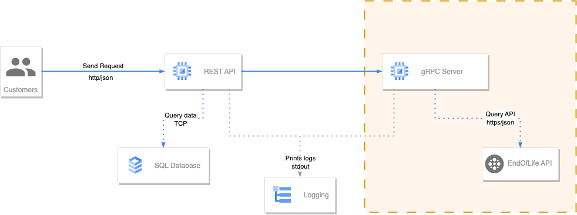

# End of life Server

**Author:Rafael Chavez Solis**

***Email:rafaelchavezsolis@gmail.com***

## Description

Contains the endoflife server application for retrive information about releases and versions of several technologies.

Expose a gRPC service API with two methods:

- GetAllVersions: Stream all versions available
- GetDetails: Returns details about specific version

Consumes the [EndOfLife API](https://endoflife.date/api/) to get the information.

## Architecture

This repository contains the componets highlighting in orange.



The logging ilustrates the use of standard log output using the *log standard package*.

### gRPC

Command to build:
```bash
protoc --proto_path=./ \
--go_out=./ \
--go_opt=paths=source_relative \
--go-grpc_out=./ \
--go-grpc_opt=paths=source_relative,require_unimplemented_servers=false \
./internal/proto/*.proto
```

## Stack:
- Go 1.23.4
- ProtocolBufers 3 (proto3)
- google.golang.org/grpc
- google.golang.org/grpc/codes
- google.golang.org/grpc/status
